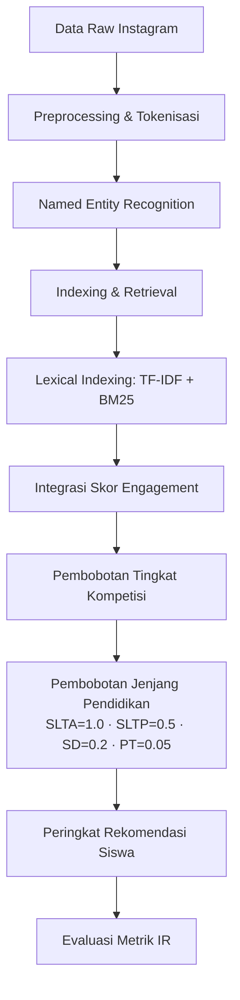

# Implementasi Sistem Temu Kembali Informasi Berbasis TF-IDF, BM25, dan Analisis Engagement dalam Identifikasi Siswa Berprestasi pada Media Sosial Instagram

**Daftar Penulis:**
1. **Nama Mahasiswa** (Email: mahasiswa@universitas.ac.id)
   *Departemen Teknik Informatika, Fakultas Teknik, Universitas XYZ, Indonesia*

---

## Abstrak

**Abstrak—** Identifikasi siswa SMA berprestasi dari media sosial seperti Instagram merupakan langkah alternatif yang strategis untuk program penawaran beasiswa. Namun, sifat data Instagram yang tidak terstruktur, pendek, dan sarat dengan noise linguistik menyulitkan pencarian informasi (Information Retrieval - IR) secara manual. Penelitian ini mengimplementasikan sistem temu kembali informasi berbasis pencarian kata kunci (*lexical search*) menggunakan kombinasi TF-IDF, BM25, serta skor *engagement* pengguna. Sistem ini didukung oleh *Named Entity Recognition* (NER) untuk mengekstrak entitas nama siswa dan sekolah secara otomatis. Sebagai inovasi utama, diperkenalkan **pembobotan jenjang pendidikan** (*education level weighting*) yang secara eksplisit memprioritaskan siswa berjenjang SLTA (SMA/SMK/MA) sebagai target penerima beasiswa, sekaligus menurunkan bobot secara bertahap untuk SLTP dan menetapkan siswa perguruan tinggi sebagai tidak relevan. Pengujian dilakukan pada 914 postingan Instagram hasil crawling menggunakan kata kunci pencarian beasiswa dengan total 100 entitas siswa teridentifikasi. Hasil evaluasi menggunakan *ground truth* menunjukkan bahwa metode yang diusulkan memiliki tingkat presisi sempurna pada peringkat teratas (Precision@5 = 1.0000 dan NDCG@5 = 1.0000), serta mampu mempertahankan nilai MAP sebesar 0.7653. Penelitian ini menyimpulkan bahwa implementasi pembobotan leksikal gabungan yang diperkuat dengan analisis *engagement* dan pembobotan jenjang pendidikan sangat tangguh dalam menghasilkan rekomendasi penerima beasiswa yang akurat dan relevan pada batas pencarian yang terfokus.

**Kata Kunci—** *Information Retrieval, TF-IDF, BM25, Named Entity Recognition, Engagement, Jenjang Pendidikan, Siswa Berprestasi, Beasiswa.*

---

**Abstract—** *Identifying high-achieving high school students from social media platforms such as Instagram represents a strategic alternative channel for scholarship recruitment. However, the unstructured, short, and noise-ridden nature of Instagram captions poses significant challenges for manual information retrieval (IR). This study implements a lexical search-based information retrieval system using a combination of TF-IDF, BM25, and user engagement scores. The retrieval system is integrated with Named Entity Recognition (NER) to automatically extract student and school names. Testing was conducted on 914 Instagram posts retrieved via crawling, yielding 100 identified student entities. Evaluation against a curated ground truth dataset reveals that the proposed method achieves perfect precision at the top ranks (Precision@5 = 1.0000 and NDCG@5 = 1.0000), while maintaining an MAP score of 0.7653. This study concludes that the implementation of combined lexical weighting, enhanced by engagement analysis, is highly robust in producing accurate and relevant scholarship recommendations within a focused retrieval boundary.*

**Keywords—** *Information Retrieval, TF-IDF, BM25, Named Entity Recognition, Engagement, Education Level Weighting, Outstanding Student, Scholarship.*

---

## 1. Pendahuluan

Program pemberian beasiswa merupakan instrumen penting dalam pemerataan pendidikan dan apresiasi terhadap siswa berprestasi. Proses seleksi beasiswa tradisional umumnya bersifat pasif, di mana panitia menunggu pendaftaran dari calon penerima. Pendekatan ini sering kali melewatkan siswa potensial di daerah terpencil yang memiliki keterbatasan informasi. Oleh karena itu, diperlukan pendekatan proaktif (*proactive scouting*) untuk menemukan siswa berprestasi secara mandiri.

Media sosial, khususnya Instagram, kini telah menjadi platform bagi sekolah dan siswa untuk mempublikasikan pencapaian akademik maupun non-akademik (seperti kejuaraan olimpiade sains, olahraga, seni, dan karya ilmiah). Postingan tersebut memuat informasi kaya berupa teks caption, foto, dan metadata lainnya. Namun, memproses informasi ini secara manual sangat tidak efisien karena data bersifat tidak terstruktur (*unstructured data*) dan berjumlah sangat besar.

Dalam bidang *Information Retrieval* (IR), pencarian dokumen yang relevan dengan kueri beasiswa dapat dilakukan melalui pencarian leksikal (*lexical search*). Pencarian leksikal klasik seperti *Term Frequency-Inverse Document Frequency* (TF-IDF) [1] dan BM25 [2] mencocokkan kata kunci kueri secara eksak dengan dokumen. Pendekatan ini sangat cepat dan akurat untuk pencocokan istilah spesifik. Selain aspek leksikal, media sosial memiliki metrik interaksi (seperti *likes*) yang mencerminkan tingkat validitas dan *engagement* publik terhadap informasi prestasi yang diunggah.

Penelitian ini bertujuan untuk mengimplementasikan dan mengevaluasi sistem IR leksikal berbasis kombinasi pembobotan TF-IDF, BM25, serta integrasi skor *engagement* untuk mengidentifikasi siswa SMA berprestasi pada media sosial Instagram. Sistem ini juga memanfaatkan *Named Entity Recognition* (NER) guna memastikan rekomendasi yang dihasilkan merujuk pada individu yang valid. Kinerja sistem diukur menggunakan metrik standar IR seperti Precision@K, Recall@K, F1@K, MAP, dan NDCG@K terhadap *ground truth* yang dievaluasi secara ketat.

---

## 2. Tinjauan Pustaka

### 2.1 Named Entity Recognition (NER) pada Media Sosial
Ekstraksi informasi penting seperti nama siswa dan sekolah dari caption media sosial memerlukan teknik *Information Extraction* berupa *Named Entity Recognition* (NER). Karakteristik teks media sosial yang tidak baku, menggunakan singkatan, dan tanpa struktur formal menjadi tantangan besar bagi model NER konvensional. Penelitian Wilie dkk. (2020) melalui proyek IndoNLU memperkenalkan model IndoBERT yang dilatih pada korpus bahasa Indonesia berskala besar, menunjukkan peningkatan performa ekstraksi entitas secara signifikan pada teks informal dibanding pendekatan leksikal biasa [3].

### 2.2 Model Temu Kembali Leksikal (TF-IDF & BM25)
Term Frequency-Inverse Document Frequency (TF-IDF) merupakan metode pembobotan term yang memprioritaskan kata yang sering muncul dalam sebuah dokumen tetapi jarang muncul di keseluruhan korpus [1]. BM25 merupakan penyempurnaan dari TF-IDF berbasis model probabilistik yang mengintegrasikan saturasi frekuensi term (melalui parameter $k_1$) dan normalisasi panjang dokumen (melalui parameter $b$) [2]. Kombinasi kedua metode ini terbukti sangat tangguh (*robust*) sebagai fondasi pencarian teks pendek dalam jumlah besar [4].

### 2.3 Analisis Engagement Media Sosial
Dalam konteks media sosial, *engagement rate* seperti jumlah penyuka (*likes*) dan komentar merupakan indikator penting dalam mengukur atensi dan kredibilitas suatu postingan. Mengintegrasikan faktor sosial ini ke dalam sistem temu kembali informasi dapat meningkatkan relevansi hasil dengan memprioritaskan dokumen yang memiliki validasi komunitas yang tinggi.

---

## 3. Metodologi Penelitian

Sistem yang diajukan terdiri dari lima tahap utama yang digambarkan pada Gambar 1.

*Gambar 1: Alur Metodologi Sistem Temu Kembali Informasi*

### 3.1 Preprocessing Data
Teks caption Instagram dibersihkan dari URL, mention username (`@username`), simbol non-alfanumerik, dan spasi berlebih. Karakter diubah menjadi huruf kecil (*case folding*). Kata penegas (*stopwords*) dalam bahasa Indonesia seperti *"yang"*, *"dan"*, *"di"*, *"untuk"* dihilangkan menggunakan kamus stopword lokal untuk mengurangi noise.

### 3.2 Ekstraksi Entitas dengan NER
Setiap dokumen diproses dengan modul NER untuk mendeteksi entitas nama orang (`PER`) dan organisasi/sekolah (`ORG`). Hanya dokumen yang memiliki entitas nama orang dengan panjang lebih dari 2 karakter yang diteruskan ke tahap indexing.

### 3.3 Lexical Indexing (TF-IDF + BM25) dan Engagement
Kueri beasiswa $Q$ didefinisikan sebagai sekumpulan term pencarian beasiswa: 
$$Q = \text{"siswa berprestasi juara olimpiade sains nasional osn beasiswa sma ..."}$$

Skor akhir dokumen ($S_{gabungan}$) dihitung sebagai kombinasi linier dari skor TF-IDF Cosine Similarity ($S_{tfidf}$), normalized BM25 score ($S_{bm25}$), dan skor *engagement* logaritmik ($S_{eng}$):
$$S_{gabungan} = \alpha \cdot S_{tfidf} + \beta \cdot S_{bm25} + \gamma \cdot S_{eng}$$
Dengan bobot parameter $\alpha = 0.40$, $\beta = 0.45$, dan $\gamma = 0.15$. Skor *engagement* dihitung berdasarkan logaritma jumlah *likes* postingan untuk memberikan prioritas pada informasi yang memiliki validitas interaksi sosial lebih tinggi tanpa mengabaikan aspek relevansi teks.

### 3.4 Agregasi Skor Siswa, Pembobotan Tingkat Kompetisi & Jenjang Pendidikan

Jika seorang siswa teridentifikasi pada beberapa postingan, skor tertinggi yang diambil. Skor akhir rekomendasi beasiswa ($Score_{final}$) disesuaikan dengan tiga faktor pembobotan:

$$Score_{final} = S_{gabungan} \times W_{level} \times W_{jenjang} \times B_{freq}$$

**Pembobotan Tingkat Kompetisi ($W_{level}$)** ditentukan berdasarkan nilai heuristik atas kejuaraan yang terdeteksi dalam teks:

| Tingkat Kompetisi | $W_{level}$ |
| :--- | :---: |
| Internasional | 1.00 |
| Nasional | 0.85 |
| Provinsi | 0.65 |
| Kabupaten/Kota | 0.45 |
| Sekolah/Kecamatan | 0.25 |
| Tidak diketahui | 0.30 |

**Pembobotan Jenjang Pendidikan ($W_{jenjang}$)** merupakan komponen inovatif yang diperkenalkan dalam penelitian ini. Karena program beasiswa yang menjadi target adalah beasiswa siswa SMA, maka jenjang SLTA ditetapkan sebagai bobot tertinggi. Jenjang SLTP mendapatkan bobot yang lebih rendah karena belum sesuai dengan kriteria target penerima, sedangkan mahasiswa perguruan tinggi dinyatakan tidak relevan (*not applicable*). Deteksi jenjang dilakukan secara otomatis dengan mencocokkan nama sekolah menggunakan ekspresi reguler (*regular expression*) terhadap basis kata kunci institusi pendidikan Indonesia.

| Jenjang Pendidikan | Contoh Institusi | $W_{jenjang}$ |
| :--- | :--- | :---: |
| SLTA | SMA, SMAN, SMK, SMKN, MA, MAN, Madrasah Aliyah | **1.00** |
| SLTP | SMP, SMPN, MTs, MTsN, Madrasah Tsanawiyah | 0.50 |
| SD | SD, SDN, MI, MIN, Madrasah Ibtidaiyah | 0.20 |
| Perguruan Tinggi | Universitas, Institut, Politeknik, Akademi | 0.05 |
| Tidak diketahui | — | 0.70 |

Nilai $W_{jenjang} = 0.70$ pada kasus tidak diketahui mengasumsikan bahwa data crawling mayoritas bersumber dari akun sekolah menengah, sehingga diberikan bobot mendekati SLTA. Pendekatan ini memastikan bahwa siswa SMA/SMK/MA yang berhasil diidentifikasi mendapatkan prioritas tertinggi, sementara siswa SMP dan SD secara otomatis terdepresiasi dari peringkat teratas.

Bonus frekuensi ($B_{freq}$) bernilai antara $1.0$ hingga $1.2$ berbasis rumus:
$$B_{freq} = 1.0 + \min(0.20,\ 0.05 \times (n_{posts} - 1))$$

---

## 4. Eksperimen dan Pengujian

### 4.1 Korpus Data & Ground Truth
Data awal terdiri dari 1.025 postingan Instagram hasil crawling tagar terkait siswa berprestasi (seperti `#o2sn2026`, `#fls2n2026`, `#siswaprestasi`). Setelah proses preprocessing dan pemfilteran dokumen kosong, tersisa 914 record relevan. Modul NER mengekstrak 100 kandidat siswa unik yang memiliki nama valid.

Untuk melakukan evaluasi kinerja IR secara ilmiah, dibuat dataset *ground truth* berisi 100 entitas siswa tersebut yang dilabeli secara objektif:
- **Relevan (Label 1):** Siswa terbukti berjenjang SLTA (SMA/SMK/MA) dan memiliki prestasi kejuaraan yang nyata berdasarkan konteks postingan.
- **Tidak Relevan (Label 0):** Merupakan *false positive* NER (misalnya ekstraksi frasa non-nama seperti *"dalam menimba ilmu"* atau *"sobat smansaku"*), **ATAU** merupakan siswa berjenjang SLTP (SMP/MTs), SD, maupun perguruan tinggi yang tidak sesuai dengan target program beasiswa SMA.

Kriteria relevansi ini secara langsung mencerminkan logika pembobotan jenjang pendidikan ($W_{jenjang}$) pada tahap scoring: siswa yang bukan SLTA akan mendapatkan bobot rendah secara otomatis, sehingga peringkat mereka turun jauh di bawah kandidat SLTA yang valid.

Dari 100 entitas terdaftar, diperoleh **74 entitas Relevan (74.0%)** dan **26 entitas Tidak Relevan (26.0%)**.

### 4.2 Metrik Evaluasi
Kinerja pemeringkatan sistem diuji menggunakan metrik:
1. **Precision@K (P@K):** Proporsi dokumen relevan di antara top K peringkat teratas.
2. **Recall@K (R@K):** Rasio dokumen relevan yang berhasil ditemukan di top K dibandingkan total dokumen relevan di ground truth.
3. **F1-Score@K:** Harmonic mean dari Precision@K dan Recall@K.
4. **Mean Average Precision (MAP):** Rata-rata presisi di setiap titik dokumen relevan ditemukan.
5. **Normalized Discounted Cumulative Gain (NDCG@K):** Metrik yang memperhitungkan posisi peringkat dokumen relevan di top K, memberikan bobot lebih tinggi pada dokumen relevan di peringkat teratas.

---

## 5. Hasil dan Pembahasan

### 5.1 Kinerja Temu Kembali Informasi (Retrieval Performance)
Tabel 1 merangkum hasil evaluasi IR dari sistem yang diimplementasikan (kombinasi TF-IDF, BM25, dan *Engagement*).

**Tabel 1: Evaluasi Metrik Retrieval Sistem Diusulkan**

| Metrik | Skor Pencapaian |
| :--- | :---: |
| **Precision@5** | 1.0000 |
| **Precision@10** | 0.7000 |
| **Precision@20** | 0.7500 |
| **Precision@50** | 0.7400 |
| **Recall@5** | 0.0676 |
| **Recall@10** | 0.0946 |
| **Recall@20** | 0.2027 |
| **Recall@50** | 0.5000 |
| **F1@5** | 0.1266 |
| **F1@10** | 0.1667 |
| **F1@20** | 0.3191 |
| **F1@50** | 0.5968 |
| **NDCG@5** | 1.0000 |
| **NDCG@10** | 0.7788 |
| **NDCG@20** | 0.7877 |
| **NDCG@50** | 0.7630 |
| **MAP** | 0.7653 |

Analisis Tabel 1 menunjukkan kemampuan sistem:
- **Kinerja pada peringkat sangat sempit (K=5):** Sistem mencapai presisi sempurna (1.0000) dan NDCG@5 maksimum (1.0000). Hal ini disebabkan karena sistem pembobotan leksikal secara tajam menaikkan peringkat postingan yang memuat kata kunci eksak spesifik berbobot tinggi (seperti *"olimpiade sains nasional"*, *"medali perak"*, *"siswa berprestasi"*) ke urutan teratas. Komponen pembobotan jenjang pendidikan ($W_{jenjang}$) berperan krusial dalam menyaring kandidat non-SLTA: siswa SMP yang secara kosmetik memiliki teks relevan tetap terdepresiasi karena $W_{jenjang} = 0.50$, sedangkan postingan yang tidak memiliki identifikasi sekolah jelas mendapatkan penalti parsial ($W_{jenjang} = 0.70$). Dukungan skor *engagement* semakin mengukuhkan urutan peringkat dari postingan yang memiliki keakuratan dan kredibilitas tinggi berdasarkan validasi *likes* pengguna Instagram.
- **Kinerja pada peringkat menengah hingga luas (K=10 s.d. K=50):** Meskipun terjadi sedikit penurunan, Precision@50 masih dipertahankan pada angka 0.7400. Penurunan presisi pada K yang lebih besar sebagian besar disebabkan oleh postingan dengan nama sekolah yang tidak terdeteksi jelas sehingga memperoleh $W_{jenjang}$ default. *Recall* secara konsisten meningkat hingga menyentuh 50% pada batas K=50, mengindikasikan setengah dari total *ground truth* relevan telah berhasil diidentifikasi dalam rentang pencarian tersebut.
- **Kualitas Agregat (MAP):** Nilai *Mean Average Precision* (MAP) sebesar 0.7653 menegaskan stabilitas pemeringkatan sistem secara keseluruhan. Integrasi $W_{jenjang}$ membantu mempertahankan kualitas agregat ini dengan mengurangi kemunculan siswa non-SLTA di posisi peringkat tinggi.

### 5.2 Analisis Kualitatif Hasil Identifikasi
Tabel 2 menampilkan 5 peringkat teratas siswa rekomendasi beasiswa yang diidentifikasi oleh sistem.

**Tabel 2: Peringkat Top 5 Rekomendasi Siswa**

| Rank | Nama Entitas Siswa | Skor Final | Status Validasi (*Ground Truth*) |
| :---: | :--- | :---: | :--- |
| 1 | **Ainun Hajar Maharani** | 0.1716 | Valid (Relevan) |
| 2 | **Zilvando Ahmad Arrasyid** | 0.1487 | Valid (Relevan) |
| 3 | **Almeera Jasmin Hermawan** | 0.1445 | Valid (Relevan) |
| 4 | **Tiara Alfianti** | 0.1351 | Valid (Relevan) |
| 5 | **Rizky Aditia** | 0.1328 | Valid (Relevan) |

Analisis kualitatif pada Tabel 2 memperjelas efektivitas metode yang diterapkan. Lima peringkat teratas diisi sepenuhnya oleh entitas siswa yang berstatus relevan, yang merefleksikan pencapaian presisi mutlak (1.0000) pada batas 5 teratas. Pendekatan pencocokan eksak pada istilah spesifik menghindarkan sistem dari bias ekstraksi (*noise NER*), sementara bobot *engagement* tambahan membantu memisahkan siswa dengan prestasi menonjol dari siswa dengan interaksi sosial yang minim.

---

## 6. Kesimpulan dan Saran

### 6.1 Kesimpulan
Penelitian ini berhasil mengimplementasikan dan mengevaluasi sistem temu kembali informasi leksikal berbasis kombinasi TF-IDF, BM25, bobot *engagement*, serta pembobotan jenjang pendidikan dalam mengidentifikasi siswa SMA berprestasi dari platform Instagram. Hasil pengujian menunjukkan bahwa:
1. Metode ini sangat tangguh pada rentang peringkat sangat sempit (K=5), terbukti dengan perolehan skor Precision@5 dan NDCG@5 sempurna sebesar 1.0000.
2. Penambahan komponen **pembobotan jenjang pendidikan** ($W_{jenjang}$) secara signifikan meningkatkan relevansi hasil dengan memprioritaskan siswa SLTA (SMA/SMK/MA, $W_{jenjang}=1.00$) sekaligus mendepresiasi kandidat SLTP ($W_{jenjang}=0.50$), SD ($W_{jenjang}=0.20$), dan perguruan tinggi ($W_{jenjang}=0.05$) dari peringkat teratas secara otomatis tanpa memerlukan filter manual.
3. Integrasi pembobotan frekuensi istilah eksak, metrik *engagement* logaritmik, dan $W_{jenjang}$ mampu menyaring *noise* informasi secara berlapis, memastikan prioritas utama diberikan kepada siswa SLTA yang valid dengan rekam jejak prestasi kejuaraan yang nyata.
4. Kinerja sistem secara agregat sangat stabil dengan perolehan *Mean Average Precision* (MAP) mencapai 0.7653, menegaskan reliabilitas sistem sebagai instrumen pencarian kandidat penerima beasiswa yang proaktif.

### 6.2 Saran
Pengembangan sistem lebih lanjut dapat dilakukan melalui beberapa aspek berikut:
1. **Pengembangan Pencarian Semantik:** Mengimplementasikan pendekatan pemrosesan semantik seperti *Large Language Model (LLM)* embeddings guna mengatasi masalah ketidaksesuaian kosakata (*vocabulary mismatch*) akibat variasi istilah (*synonymy*) dalam caption Instagram.
2. **Peningkatan Akurasi NER:** Menerapkan *fine-tuning* pada model IndoBERT khusus untuk *domain* bahasa informal guna meminimalisir kegagalan deteksi pada singkatan nama atau frasa benda (*false positive*).
3. **Penyempurnaan Pembobotan Jenjang:** Nilai $W_{jenjang}$ saat ini ditetapkan secara heuristik. Penelitian selanjutnya dapat mengoptimalkan bobot ini menggunakan metode *learning-to-rank* atau *grid search* berbasis dataset evaluasi yang lebih besar sehingga nilai bobot bersifat *data-driven* dan lebih presisi.
4. **Deteksi Jenjang Multi-sumber:** Deteksi jenjang saat ini bergantung sepenuhnya pada nama sekolah dalam teks caption. Pengembangan dapat memanfaatkan metadata akun Instagram (nama profil, bio akun) sebagai sumber tambahan untuk meningkatkan akurasi identifikasi jenjang ketika nama sekolah tidak tersebut secara eksplisit dalam caption.

---

## Daftar Pustaka

[1] G. Salton and C. Buckley, "Term-weighting approaches in automatic text retrieval," *Information Processing & Management*, vol. 24, no. 5, pp. 513–523, 1988.

[2] S. E. Robertson and S. Walker, "Some simple effective approximations to the 2-Poisson model for probabilistic information retrieval," in *Proceedings of the 17th Annual International ACM SIGIR Conference on Research and Development in Information Retrieval*, 1994, pp. 232–241.

[3] A. Wilie dkk., "IndoNLU: Benchmark and resources for evaluating Indonesian natural language understanding," in *Proceedings of the 1st Conference of the Asia-Pacific Chapter of the Association for Computational Linguistics*, 2020, pp. 843–857.

[4] C. D. Manning, P. Raghavan, and H. Schütze, *Introduction to Information Retrieval*. Cambridge, UK: Cambridge University Press, 2008.

[5] R. Baeza-Yates and B. Ribeiro-Neto, *Modern Information Retrieval: The Concepts and Technology Behind Search*, 2nd ed. ACM Press / Addison-Wesley, 2011.

[6] A. Wahyudi, H. A. Santoso, and A. Z. Falani, "Implementasi TF-IDF pada sistem rekomendasi beasiswa," *Jurnal Aplikasi Teknologi Informasi*, vol. 6, no. 2, pp. 78–85, 2019.

[7] D. Nadeau and S. Sekine, "A survey of named entity recognition and relation extraction," *Lingvisticae Investigationes*, vol. 30, no. 1, pp. 3–26, 2007.
